# Texture generator: notebook results

Generated by [the Python workflow notebook](texture_generator_workflow.ipynb).
Run all cells to regenerate these PNG files and this document. Images are
stored separately in `images/`; no image data is embedded in the notebook.

Every image from the notebook is shown below. The [recipe manifest](manifest.json)
records the exact arguments and PNG checksums. Exact reproduction also depends
on the dependency versions and platform. The saved floating-point array is
[metal-brushed.npy](data/metal-brushed.npy).

## Environment

```json
{
  "python": "3.14.7",
  "platform": "darwin",
  "architecture": "arm64",
  "texture-generator": "0.3.0",
  "numpy": "2.5.2",
  "pillow": "12.3.0"
}
```

All variant-gallery tiles use seed 42 and size 384 x 384. The contact sheet
uses its own master seed and draws individual tile seeds.

Paper measurement previews use min-max greyscale normalisation for display;
their displayed brightness is not a physical unit.

## Pillow image

### Wood / board — Pillow quickstart

640 x 480 · RGB

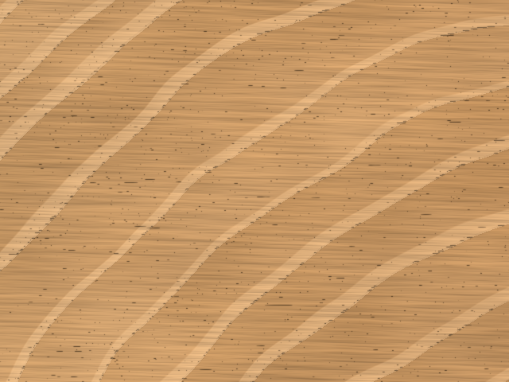

## NumPy array

### Metal / brushed — NumPy array as a PNG

256 x 256 · RGB

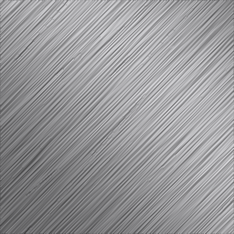

## All variants — metal

### metal / brushed

384 x 384 · RGB

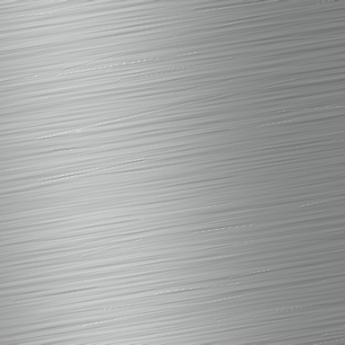

### metal / radial

384 x 384 · RGB

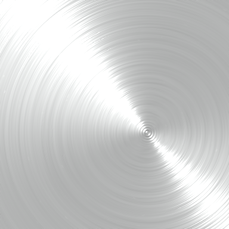

### metal / polished

384 x 384 · RGB

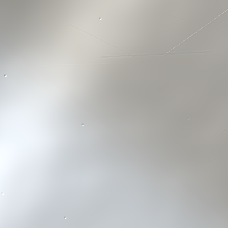

### metal / heat_tinted

384 x 384 · RGB

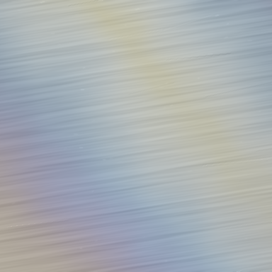

### metal / oil_film

384 x 384 · RGB

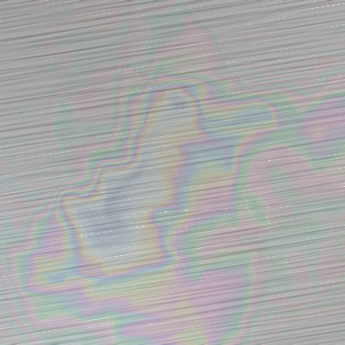

### metal / anodised_titanium

384 x 384 · RGB

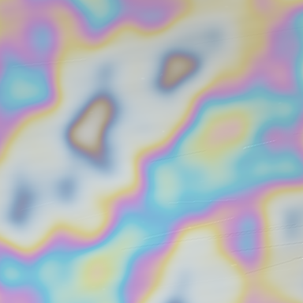

### metal / engine_turned

384 x 384 · RGB

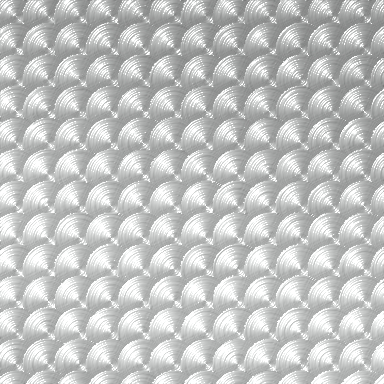

## All variants — plastic

### plastic / glossy

384 x 384 · RGB

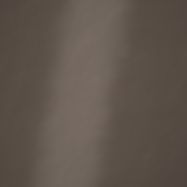

### plastic / matte

384 x 384 · RGB

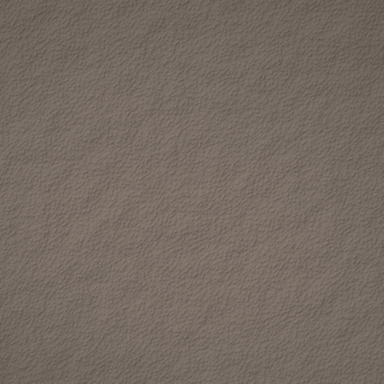

### plastic / textured

384 x 384 · RGB

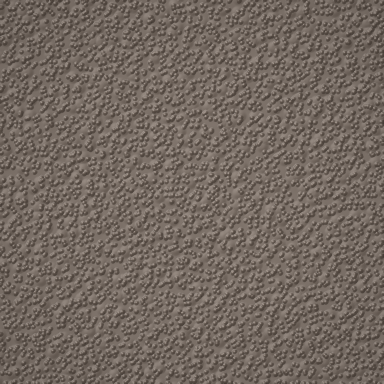

## All variants — wood

### wood / board

384 x 384 · RGB

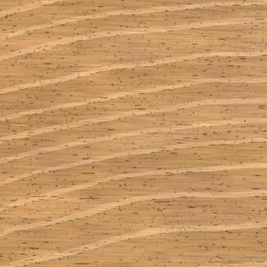

### wood / planks

384 x 384 · RGB

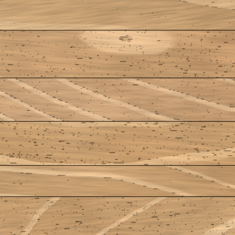

## All variants — paper

### paper / white

384 x 384 · RGB

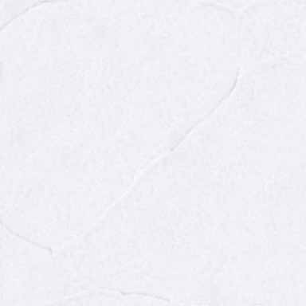

### paper / kraft

384 x 384 · RGB

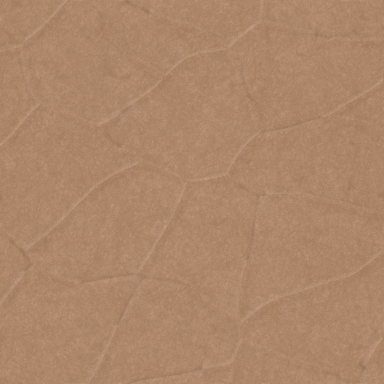

### paper / recycled

384 x 384 · RGB

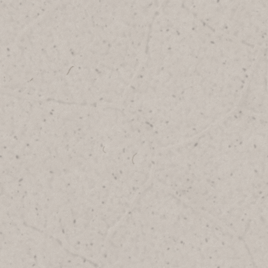

### paper / newsprint

384 x 384 · RGB

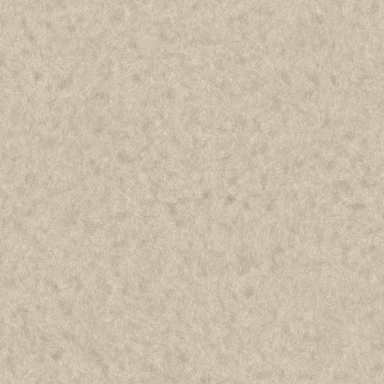

### paper / laid

384 x 384 · RGB

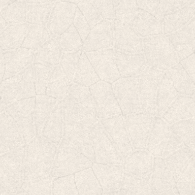

### paper / coated

384 x 384 · RGB

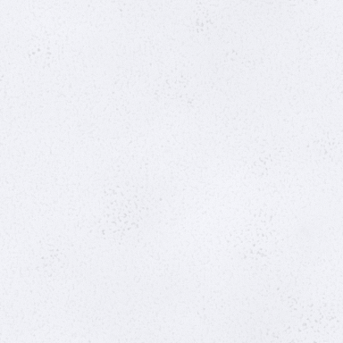

## Reproducible seeds

### Plastic / matte — seed 12

384 x 384 · RGB

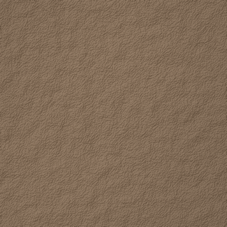

### Plastic / matte — seed 13

384 x 384 · RGB

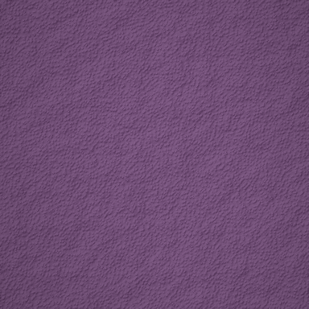

## Automatic variant selection

### Metal / brushed — seed-selected variant

384 x 384 · RGB

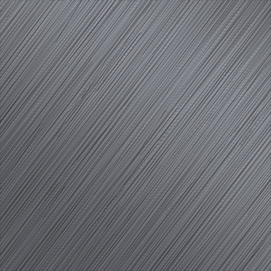

## Material controls

### Walnut / quartersawn — finish none

384 x 384 · RGB

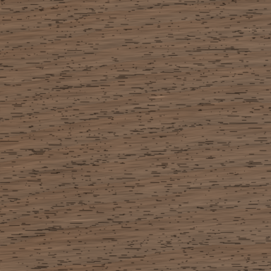

### Walnut / quartersawn — finish oil

384 x 384 · RGB

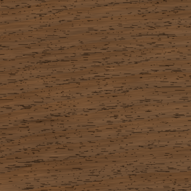

### Brushed metal / oil film

384 x 384 · RGB

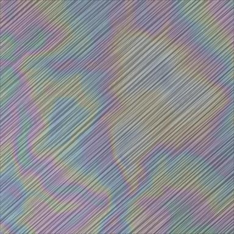

## Paper measurements

### Paper / laid — measurement example

384 x 384 · RGB

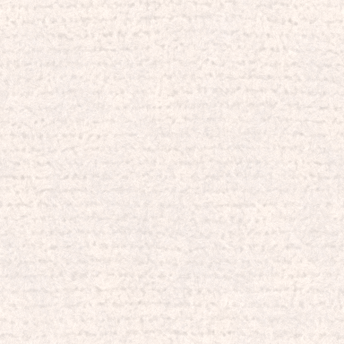

### Paper / mass — normalised greyscale preview

384 x 384 · RGB

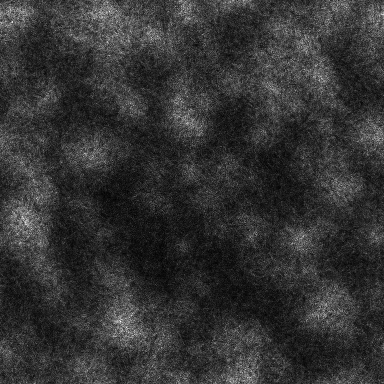

### Paper / formation — normalised greyscale preview

384 x 384 · RGB

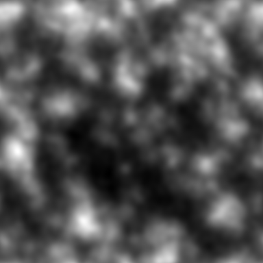

## Contact sheet

### All materials — labelled contact sheet

798 x 1066 · RGB

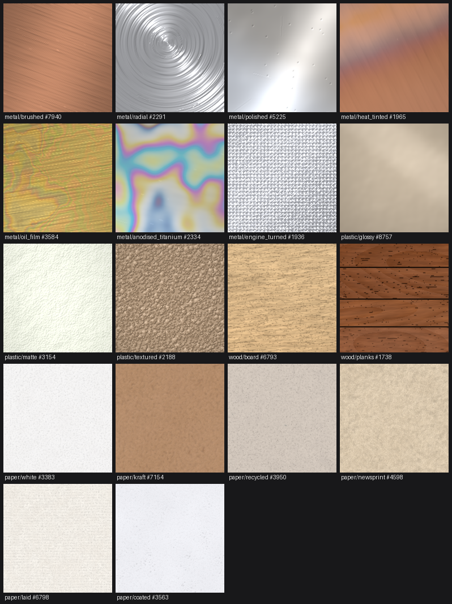
